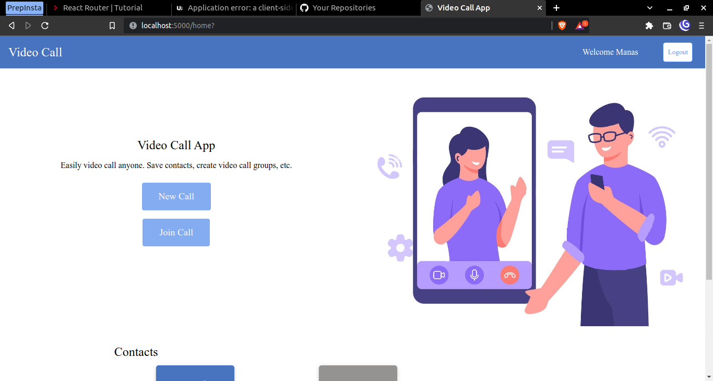
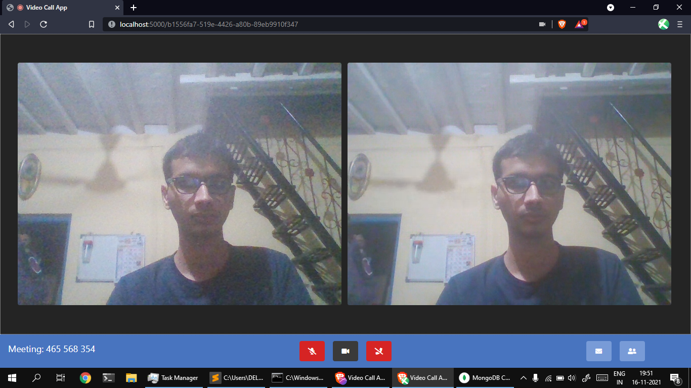

# Video Calling App

This is a web based video calling app made using WebRTC. 

## Features:
1. Account Creating and login
2. Creating contacts
3. Realtime video calling
4. Instant messaging during the call

## Technologies and Tools used
1. Node JS
2. Express JS
3. Sockets.io
4. Peer JS (Web RTC library)
5. Mongo DB

## Screenshots

### Home Page after login

### Call Page with two participants
